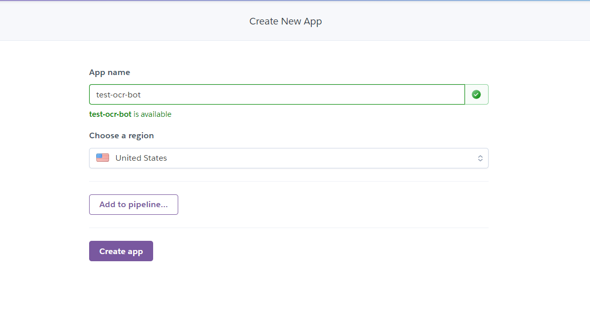
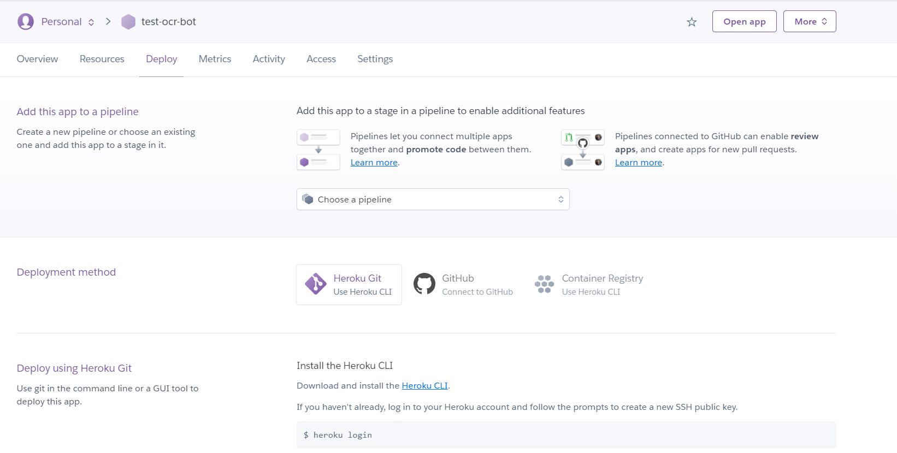
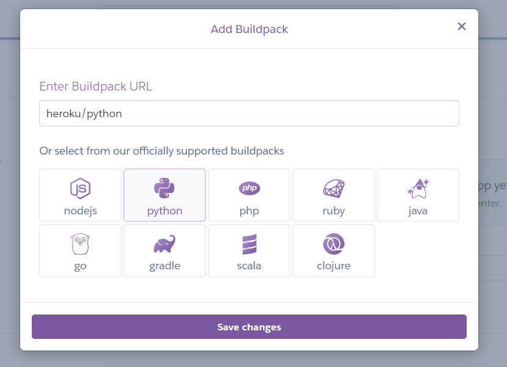
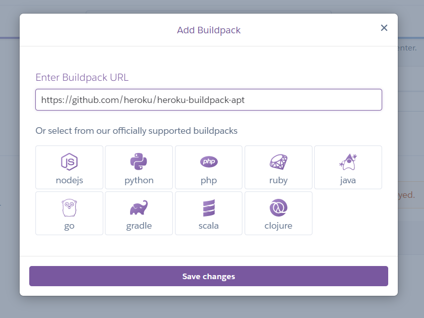
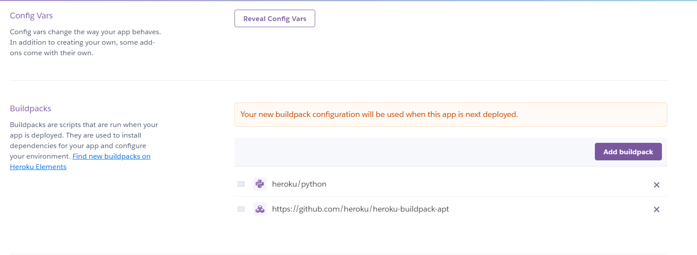
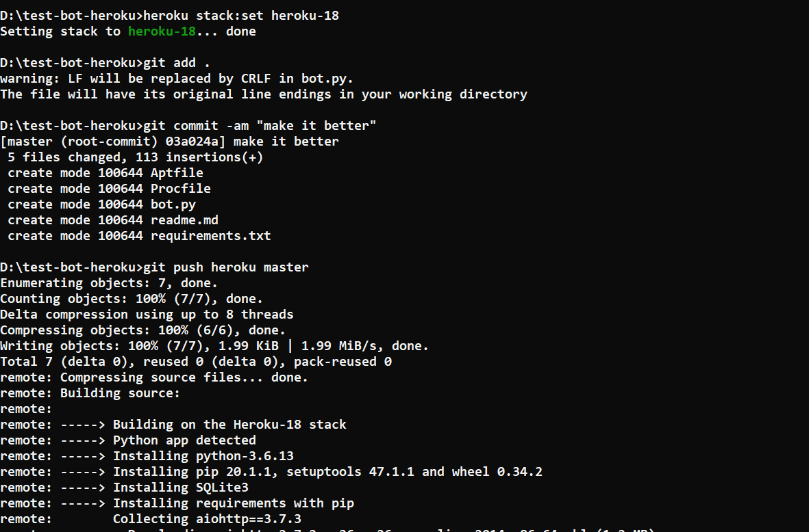
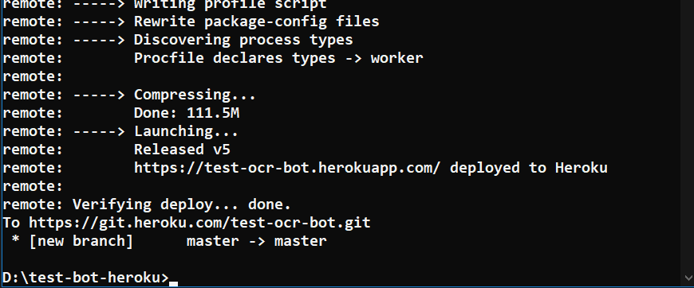

# OCR - Bot
A Simple Discord Bot for OCR which is enabled by [pytesseract](https://pypi.org/project/pytesseract/) library. Deployable on Heroku (steps to deploy below).

If you just want to add an OCR bot on your server , use this  [OCR-BOT](https://discord.com/api/oauth2/authorize?client_id=805507110363201547&permissions=2048&scope=bot).

As a personal preference, this bot requires no command to do OCR. So add it to a separate channel and make sure other channels are not visible to it.


# Instructions:
 - Clone the repo
 - Install all the requirements
     ```sh
    pip install -r requirements.txt
    ```
- These requirements include "opencv-headless", if you are trying it on a machine which doesn't support it, install the [normal OpenCV](https://pypi.org/project/opencv-python/) library.

- Install tesserct-ocr using this command:
    - On Ubuntu
      ```
      sudo apt-get install tesseract-ocr
      ```
    - On Mac
      ```
      brew install tesseract
      ```
    - On Windows, download installer from [here](https://github.com/UB-Mannheim/tesseract/wiki)
 
- ### Don't forget to add your "BOT_TOKEN" in the "bot.py" file.

- Run the python bot using the command: 
    ```sh
    python bot.py
   ```
    or
    ```sh
    python3 bot.py
    ```
 <br />
 <br />

# Deploying on Heroku (as on Feb-2021)
- Create an account on [Heroku](https://www.heroku.com/)
- Click on "New" -> "Create new App" <br />

 { width: 200px; }

- When you click on "Create App", you'll be greeted with this section : <br />



- Jump to "Settings" where you'll scroll down to see "Config Vars" & "Buildpacks": <br />


- Add "Python Buildpack" and the below mentioned buildpack : 

     ```sh
    https://github.com/heroku/heroku-buildpack-apt
    ```
    <br />

    

     

    

    <br />

- After adding both buildpacks, click on "Reveal Config Vars" : <br />

    

- Add the below mentioned "Key = Value" Pair :

     ```sh
    TESSDATA_PREFIX = ./.apt/usr/share/tesseract-ocr/4.00/tessdata
    ```
    <br />

    


- After adding both Buildpacks and Config variables,  we're now ready to deploy.

- Follow the Steps given in "Deploy" section of your Heroku app. <br />

- ### But,  First we have to change the Heroku stack to "heroku-18"

    - Changing it to "heroku-18" made it work for me.

    - Type in the first three commands in your bot directory (assuming you have [heroku CLI](https://devcenter.heroku.com/articles/heroku-cli) installed) : 

    ```sh
    heroku login
    ```

    ```sh
    git init
    ```

    ```sh
    heroku git:remote -a "Your-app-name"
    ```


     

     <br /> 

    - Before the "git add ." command, use this command to change the stack to "heroku-18"

         ```sh
         heroku stack:set heroku-18
        ```

         
        <br />

    - Then you can proceed with the commands : 

    ```sh
    git add .
    ```

    ```sh
    git commit -am "make it better"
    ```

    ```sh
    git push heroku master
    ```
            
    

    <br />

    
    
- It'll take time to push the bot to heroku. Be patient.

- After the build has succeeded, you can go and start your bot by going into "resources" tab and turning the "bot.py" worker ON.

    - Click on the edit icon and turn the bot ON.

    

- That's it, your bot is now live. (If you didn't forget to add your "BOT_TOKEN" in the bot.py file.)
    


